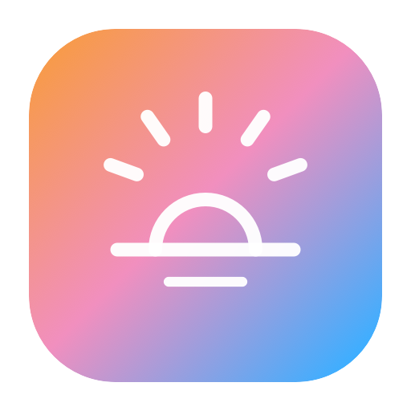
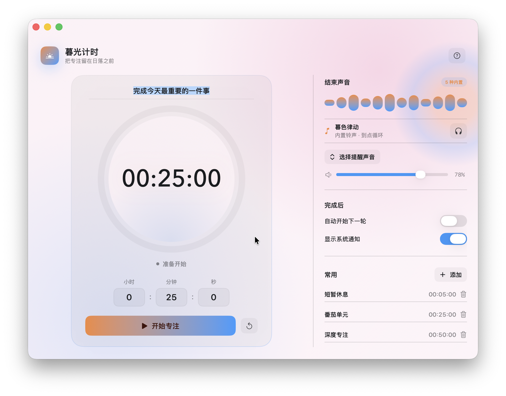
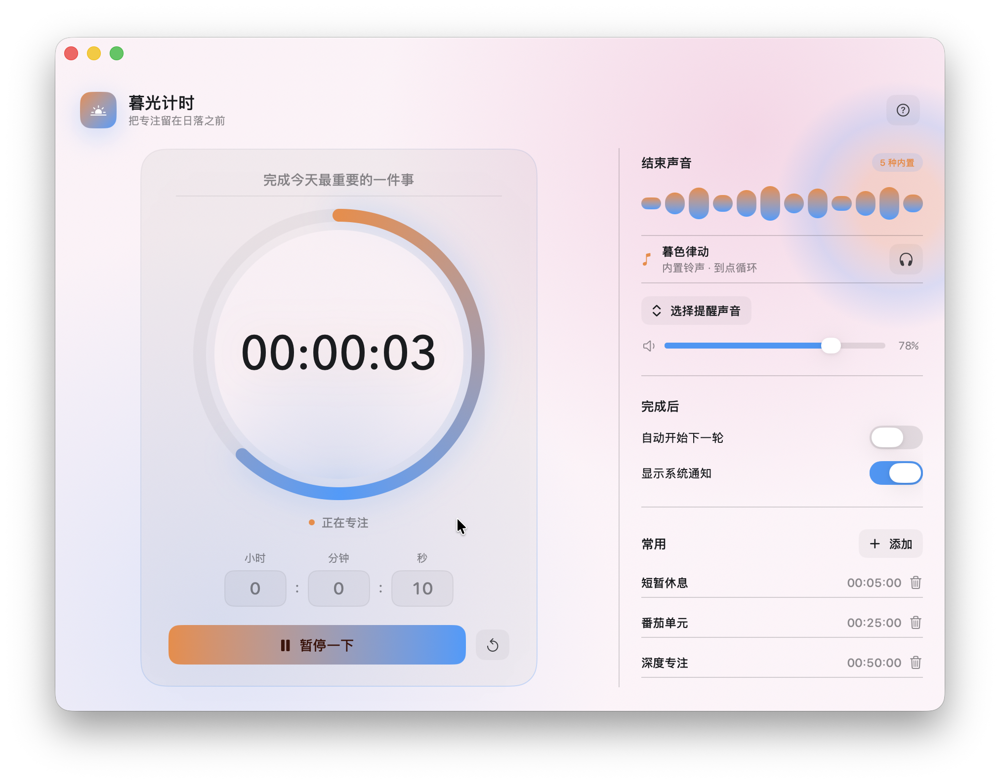
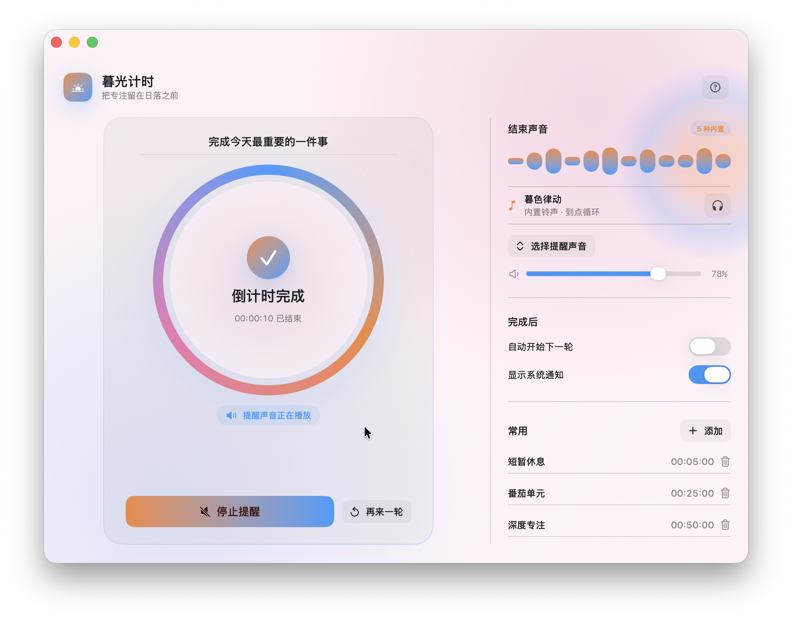

# 暮光计时

## 把专注留在日落之前

暮光计时是一款面向 macOS 的轻量倒计时工具。它把精确到秒的计时、柔和的暮光视觉、内置提示音和常用节奏放在同一个安静、专注的窗口里。

### 准备开始

### 专注进行中

### 倒计时完成

> 以上产品图均为当前版本在 macOS 上的真实窗口截图。

## 适合谁

- 需要一个不打扰工作流的专注计时器
- 使用番茄工作法、深度工作或短暂休息节奏的人
- 希望使用自己的结束声音，而不是固定系统提示音的人
- 需要同时打开多个独立计时窗口的人

## 核心功能

### 精确到秒

小时、分钟和秒都可以独立设置。计时完成后，左侧会进入清晰的完成状态，并提供停止提醒和再来一轮操作。

### 内置与自定义声音

应用内置 5 种提醒声音，支持下拉选择、试听和音量调节；也可以选择本地音频作为每个窗口独立的提醒声音。

### 常用节奏

常用区域默认提供：

- 短暂休息：5 分钟
- 番茄单元：25 分钟
- 深度专注：50 分钟

用户可以添加自己的名称和时长，也可以随时删除不再需要的项目。

### 多窗口工作流

每个窗口拥有独立的计时、标题、声音、音量、自动下一轮和系统通知设置，适合同时管理不同任务。

### 安静但清晰的视觉反馈

浅粉到淡蓝的暮光背景、半透明玻璃面板和轻量进度圆环，让状态信息保持清晰，同时避免传统计时器的压迫感。

## 三步开始

1. 输入小时、分钟和秒，给计时器设置一个标题。
2. 选择内置声音或本地音频，调整音量。
3. 点击“开始专注”，或使用空格键开始/暂停。

快捷键：

- 空格：开始 / 暂停
- `⌘R`：重置
- `⌘N`：新建窗口
- `ESC`：关闭帮助说明

## 下载

当前版本可从 [GitHub Releases](https://github.com/Estellalee/twilight-timer/releases/latest) 下载。

- 支持 macOS 13.0 或更高版本
- 当前 Release 支持 Apple Silicon（`arm64`）
- 当前版本使用临时签名，首次启动可能需要右键选择“打开”
- Intel Mac 需要后续 Universal 版本

完整安装说明见项目 [README](../README.md)。

## 隐私与授权

自定义声音和常用计时只保存在本机。内置声音的授权说明随项目文件提供；公开再分发时请保留对应鸣谢和授权信息。

## 项目信息

- 平台：macOS
- 技术：SwiftUI、AVFoundation、UserNotifications
- 当前版本：1.5.0
